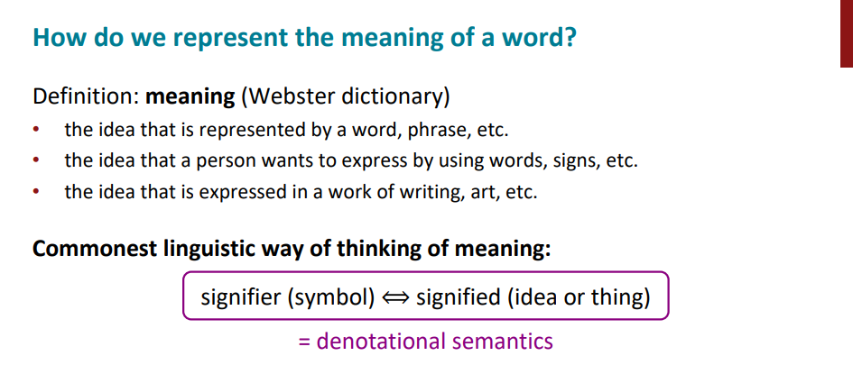
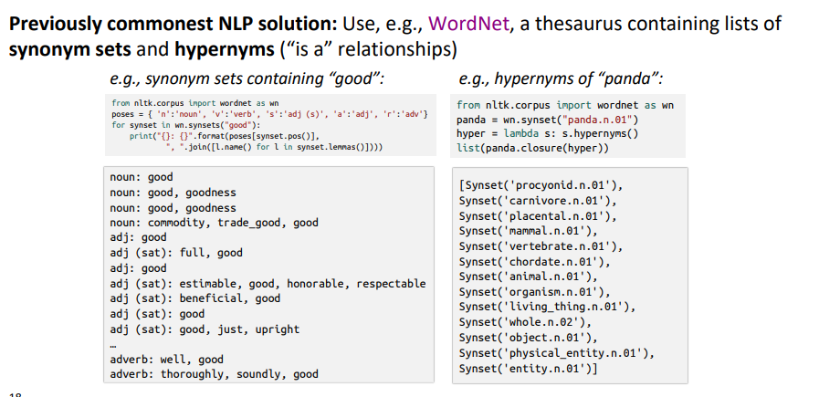
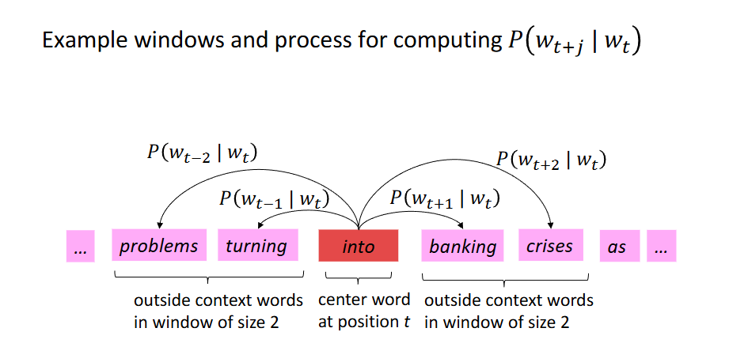
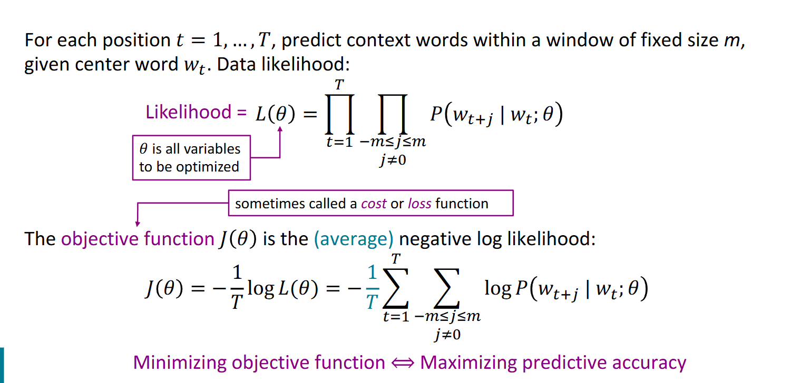
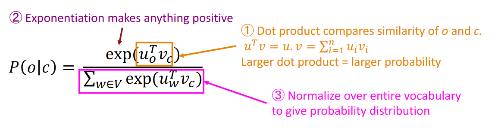
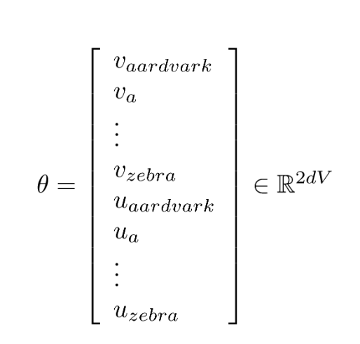
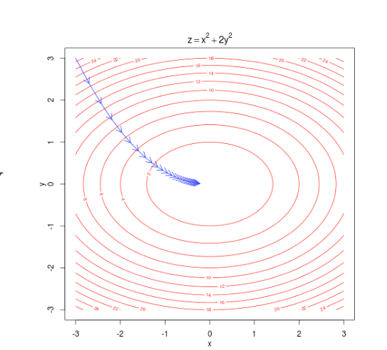
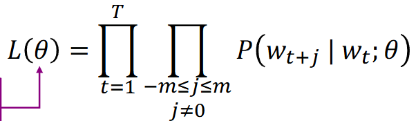

# **[cs224n NLP 강의정리]** Lecture 1. Introduction and Word Vectors [출처] [[cs224n NLP 강의정리] Lecture 1. Introduction and Word Vectors](https://blog.naver.com/skchajie/222031897088)\

참조 : https://blog.naver.com/skchajie/222031897088

강의 영상 : https://www.youtube.com/watch?v=DzpHeXVSC5I&list=PLoROMvodv4rOaMFbaqxPDoLWjDaRAdP9D

## 1. Human language and word meaning

인간에게 언어 -> 소통이 있다는 것은 엄청난 차별화 요소이다.

언어는 또한 더 높은 사고를 하게 해준다.



프로그래밍에서의 meaning은 denotation(지시적 의미)를 가진다. while , if 같은 언어 -> 지시적 의미

### 실습1 wordnet를 활용한 실습

고급 유의어 사전



practice_01.wordnet.ipynb에서 실습

```
from nltk.corpus import wordnet as wn
```

NLTK 라이브러리 말뭉치(corpus) 중에서 wordnet 사전을 불러옵니다.

```
poses = { 'n':'noun', 'v':'verb', 's':'adj (s)', 'a':'adj', 'r':'adv'}
```

파이썬 딕셔너리 자료구조를 만듭니다. Wordnet의 품사 확인 시 짧은 단일 알파벳으로 알려줍니다. 나중에 화면 출력 시 보기 좋도록 바꿔서 표시합니다.

```
for synset in wn.synsets("good"):
```

`wn.synsets("good") `: 사전에 "good" 을 검색해 나오는 모든 의미의 묶음을 리스트로 가져옵니다.

`for ~ in ~` : 가져온 여러 개의 의미 묶음을 순서대로 하나씩 synset이라는 변수에 담아 아래의 코드를 반복합니다.

```
    print("{}: {}".format(poses[synset.pos()], ", ".join([l.name() for l in synset.lemmas()])))
```

품사: 단어1, 단어2 형태로 출력하는 역할입니다.

`synset.pos()` : 현재 꺼낸 의미 묶음의 품사 기호를 확인합니다.

`poses[...]` : 위에서 만든 딕셔너리를 써 기호를 완전한 단어로 바꿉니다.

`synset.lemmas()` : 의미 묶음에 속한 실제 동의어(lemma) 단어의 정보를 모두 불러옵니다.

`[l.name() for l in ...]` : 파이썬 리스트 컴프리헨션 문법입니다. 가져온 단어 정보들(l) 에서 딱 단어 이름 글자(.name())만 골라내어 리스트로 만듭니다.

`", ".join(...)` : 뽑아낸 단어 리스트 사이사이에 쉼표 띄어쓰기를 붙입니다.

`"{}: {}".format(A,B)` : 앞 빈칸 { }에 품사를 넣고 뒤 빈칸 {}에 이어 붙인 단어들을 넣어 완성합니다.

```
from nltk.corpus import wordnet as wn
```

- `"panda.n.01"` 은 검색어가 아니라 특정 개념을 정확히 지칭하는 고유 아이디 같은 것입니다.
  - **panda** : 단어
  - **n** : 품사 (명사)
  - **01** : 그 단어의 1번째 의미
- 이렇게 '판다 동물의 첫 번째 의미'라는 특정한 개념을 가져와 panda에 저장합니다.

```
hyper = lambda s: s.hypernyms()
```

`labda` 는 파이썬에서 한 줄짜리 간단한 함수 만들 때 사용합니다.

어떤 개념 s 가 들어오면, `s.hypernyms()` 를 실행하는 함수를 만들고 이름을 `hyper`로 지어줍니다.

`.hypernyms()`는 현재 단어를 포괄하는 **바로 한 단계 상위 개념**을 찾아주는 함수입니다. (예: 판다의 상위어는 프로키온)

```
list(panda.closure(hyper))
```

`.closure(함수)`는 괄호 안에 넣은 함수를 **더 이상 결과가 나오지 않을 때까지 끝까지 반복해서 실행**하라는 의미입니다.

`panda`에서 시작해서 상위어 찾는 함수(`hyper`)를 반복합니다.

이를 list로 반환해서 출력합니다.

wordnet의 한계

계산적 의미에서 유효하지 않습니다.

여러가지 문제로 인해 wordvectors 의 개발로 발전했다.

### Representing words

#### one-shot-vectors : 단어에 해당하면 1, 나머지는 0인 벡터로 표혀하는 방법이다.

1. 이것도 문제가 있다
   1. 0과 1 로만 표현이 되어 hotel motel 둘 간의 연관성이 있다는 표시가 전혀 없습니다.
   2. 벡터에 서로 다른 곳에 1이 위치해 있을 뿐입니다.
   3. 수학적으로 두 벡터가 독립적이고, 직교(orthogonal) 하여 유사도 계산X
      1. 예를 들어, motel = [ 0000001000] , hotel = [0000100000] 이면 , motel (내적) hotel^T = 0
   4. 유사성에 대한 자연스러운 개념이 없음

#### Word vectors

비슷한 유사도를 가진 단어들은 비슷한 벡터를 가질 것이고, 내적했을 때의 값이 크다.

좋은 단어 벡터를 배워야한다. 이를 임베딩(embedding)이라고 부름.

공간의 차원 = 벡터의 길이 but, 인간은 고차원을 볼 수 없다.

비슷한 의미의 것들이 가까운 곳에 위치해 있다 -> 이 목표에 어떻게 도달할 것인가?

#### Word2vec

방대한 양의 텍스토로 시작 (코퍼스)

텍스트들을 순회하면서 중심 단어와 주변 단어들을 찾음



예시) turning 다음 into 가 올 확률을 구하고 싶음

    1. turning이라는 단어가 into 라는 단어에 가까운 위치에 나타날 확률 계산

    2. 그 후 가까운 곳의 문맥을 사용해 최대한 정확한 추정치를 계산해야함.

    3. 그후 다음 단어인 banking에서도 같은 작업을 실시해 택스트 전체를 계산 -> 단어 벡터 계산



Likelihood의 최대값이어야함.

모든 텍스트의 위치와 문맥 속 모든 단어를 보고, P(~~)를 크게 해야함(Likelihood 계산 식 내의 마지막 P)

Objective function은 부호 -를 붙여 최소화 한다. 또한 곱셉의 계산이 복잡하기에 log를 취해서 sum을 할 수 있도록 바꿔준다.

-부호가 여전히 있기에, 로그 확류의 합을 최소화 해야한다.

결국, 목적함수를 최소화 함으로써, 단어의 확률을 최대화 할 수 있다.

objective function을 계산하기 위해서는 **P**(**w**t+**j**∣**w**t;**θ**)를 구해야 한다.

같은 단어가 중심 단어로 쓰일 때와 문맥 단어로 쓰일 때 다른 의미를 가질 수 있도록 하나의 단어당 2가지의 벡터를 사용한다.

- **v**w: **w**가 중심 단어일 때
- **u**w: **w**가 문맥 단어일 때



### To train the model, Optimaize value of parameters to minimize loss

모델 학습을 위해 손실값을 줄이기 위해 파라미터 조정이 필요함. 해당 파라미터는 목적함수를 파라미터에 대해 미분해 기울기를 구하는 과정이 필요

θ : 모델의 모든 파라미터를 포함한 하나의 벡터. 학습 대상이 되는 모든 단어의 벡터 표현이 포함





파라미터 최적화를 위한 경사 하강법을 사용. 각 위치에서 기울기에 따라 내려가며 손실 최소화.




