참조 : https://velog.io/@jack_7711/NLP-CS224N-%EC%A0%95%EB%A6%AC-2%EA%B0%95

https://manywisdom-career.tistory.com/8

https://velog.io/@jinseock95/CS224n-Natural-Language-Processing-with-Deep-Learning-Stanford-Winter-2019

영상 : https://www.youtube.com/watch?v=nBor4jfWetQ&list=PLoROMvodv4rOaMFbaqxPDoLWjDaRAdP9D&index=2

## Word Vector 학습의 원리

    단어를 숫자 벡터로 표현해 단어 의미 간 유사성 찾기

    Gradient Descent(경사 하강법) 기법 사용

### Gradient Descent

    모델의 예측값과 실체값의 차이(손실 함수)를 줄이기 위해 매개변수를 계속해서 업데이트 하는 방식

    Stochastic Gradient Descent, SGD 를 소개

    SGD는 게이터 일부만 사용하는 모델로 더 빠름

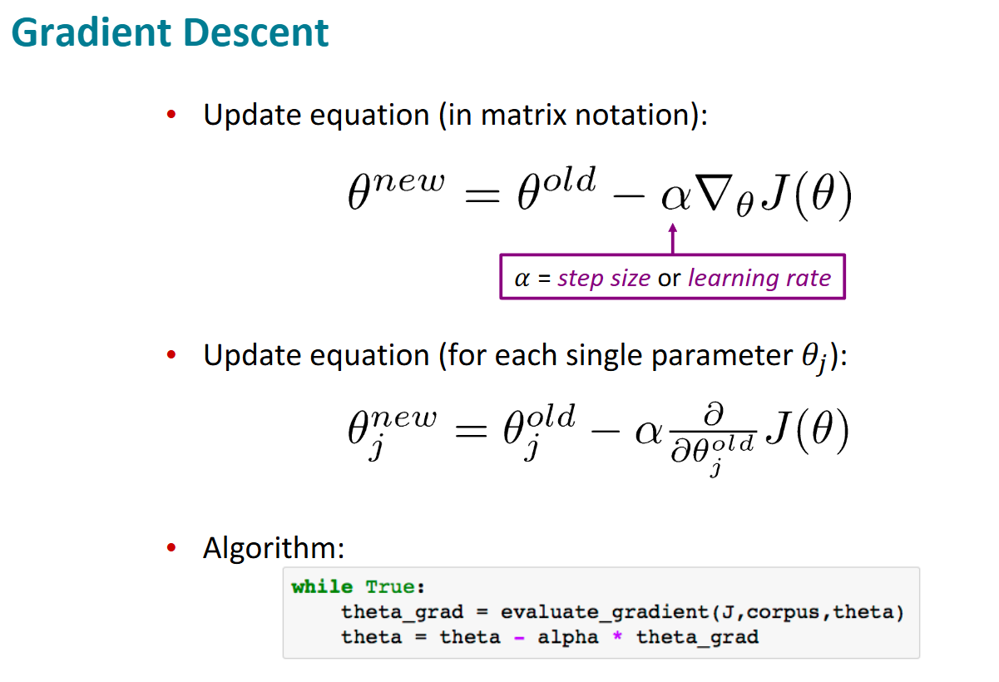

손실 함수 J가 있고, 그 기울기를 계산해야한다.

변화의 폭이 너무 크면 크게 벗어날 수 있음

잘 사용하지 않음 -> Stochastic Gradient Descent, SGD 를 사용

원래 사용하는 방식은 오래 걸리고, 계산량도 너무 큼. 따라서 SGD를 사용

SGD : 작은 부분 집합을 사용 일부의 데이터만 사용하기 때문에 문제가 생길 수 상대적으로 오류가 클 수 있음

### Word2Vec 학습 과정(전 강의 리뷰)

    벡터를 무작위로 작은 숫자로 초기화 해야함 , 모든 벡터를 0으로 하면 작동하지 않음. 똑같이 모든 것이 처음부터 같으면 잘못된 대칭성을 가지게 되어, 잘못된 학습을 함

    특정 단어를 중심으로 그 주변을 예측해 벡터 값 조정

    위 과정을 반복

    실습 : 해당 파일의 ipynb 참조

Negative Sampling

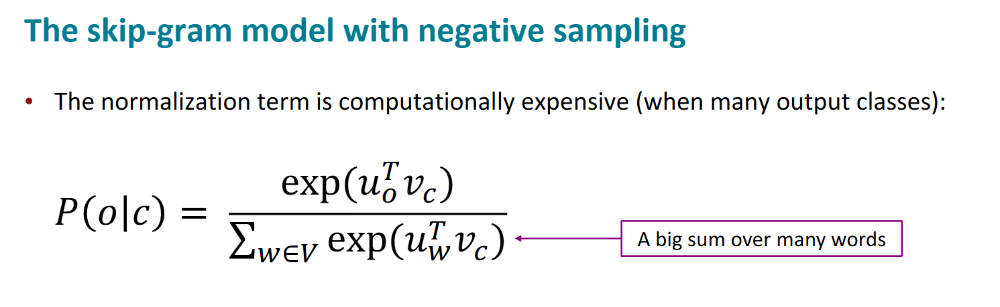

### 간단한 softmax 방정식 분모 : 모든 단어의 합계

아이디어 : 모든 다어에 대해 평가하는 대신, 실제 단어를 예측하는 로지스틱 회귀 모델을 학습시키기. 임의의 다른 단어를 고르면, 중심 단어는 이에 부정적인 반응을 갖을 것임.

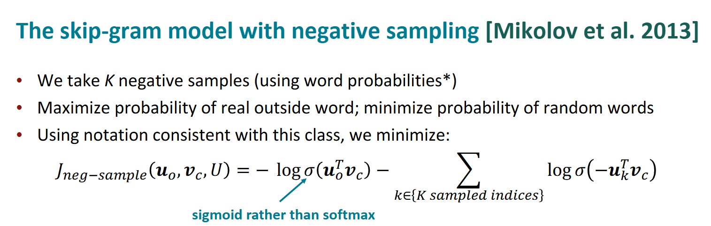

softmax를 사용하지 않고, sigmoid를 사용

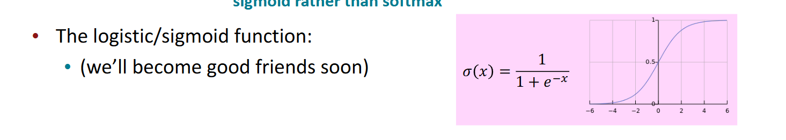

### 시그모이드(로지스틱) - 임으이의 실수에 대해 0~1 확률로 나타냄 위 식에서 내적이 클 수록 확률이 1에 수렴

식에 -(negative sampling의 식) - 가 붙어있으므로, 작을 수록 1에 수렴해 커지게 된다.

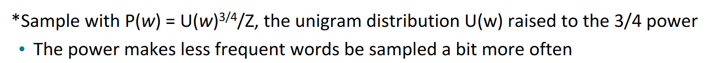

많은 단어들 중에 무작위로 고르는 것은 좋은 방법이 아님.

단어들이 얼마나 자주 쓰이는 지 기울기를 사용해야함. -> Unigram distribuition(단어 분포) - 단어 하나하나가 얼마나 쓰이는 지 나타냄

더 좋은 대안 : 단어의 단일어 확률에 3/4 제곱을 하기 -> 빈도가 낮은 단어는 상대적으로 더 많이 학습시킨다

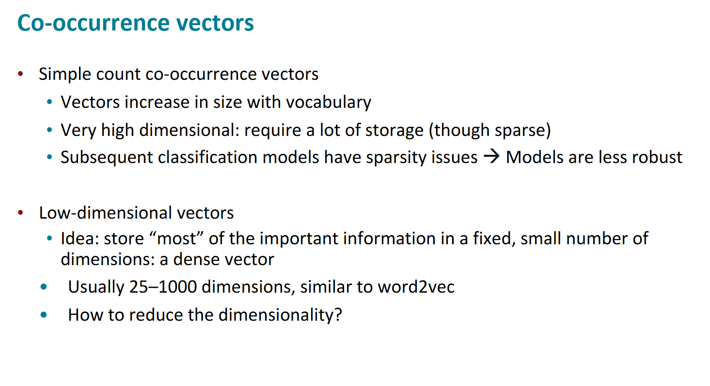

너무 많은 계산량은 비효율적이다. 그렇다면 어떻게 해결할 것인가 ? PCA, SVD 등의 방법이 있음.

### SVD(특이값 행렬)

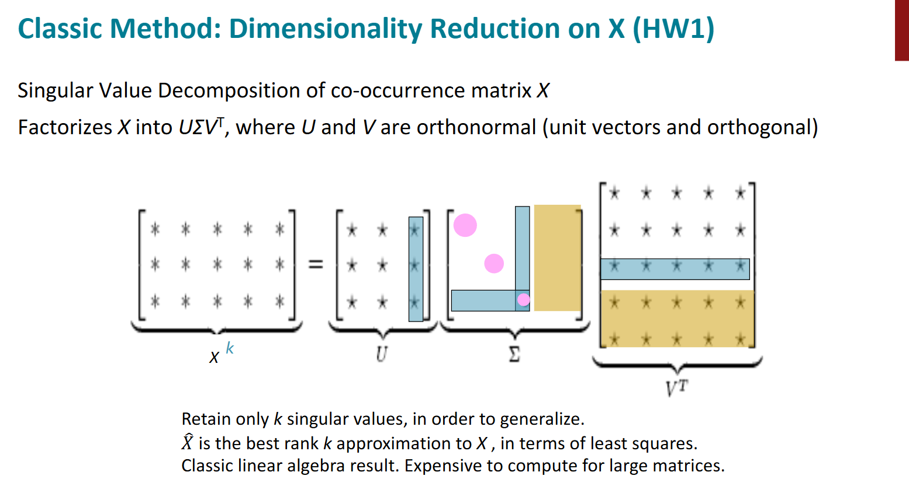

중간 Σ행렬 크기를 조절함으로써, 단어 벡터의 차원을 줄이고, 특이값 크기로 차원을 구할 수도 있음.

### Hacks to X

하지만, 개수 기반의 동시 등장 행렬에 SVD를 적용하는 것은 효과적이지 못함(the,he,has 같은 기능어들이 자주 등장하는 반면, 의미론적으로 비교적 덜 등장하는 단어들에 대해 의미론적 분석이 어려움)

해결 방안

- log the frequencies: 빈도에 log를 취함으로써, 빈도가 큰 단어들에 대해 패널티를 줍니다.
- min(X, t), with t ≒ 100: 특정 빈도수 이상의 단어들에 대해 패널치를 줍니다.
- Ignore the function words: 전처리를 통해 기능어들을 아에 빼줍니다.
- Ramped windows: 멀리 있는 단어보다 가까이 있는 단어의 중요도를 높여주는 특수한 window를 통해 동시 등장 행렬을 만들어줍니다.
- Using Person correlation: 개수(count) 대신 상관 계수를 사용합니다.

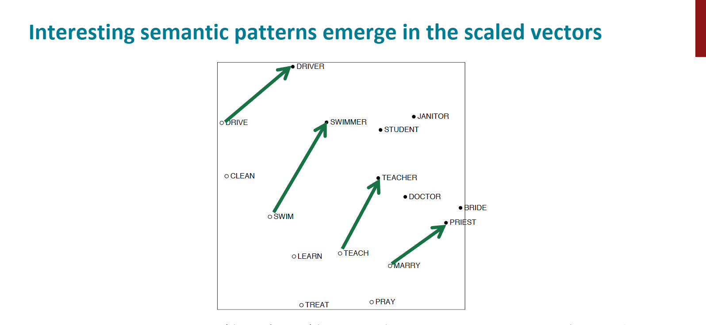

알 수 있는 점 : 단어끼리 관계가 벡터 공간에 투영 됨. 위 그림을 예시로, 해당 동작을 수행하는 사람과의 관계를 보여줌. 해당 관계를 나타내는 벡터들은 크기와 방향을 대략 유사함을 확인 가능.

### GloVe : Encoding meaning components in vector differences

앞서 단어 벡터 만든 방법들

- window를 활용하는 방법
  - 장점: 예측 기반으로 단어 간 유추 작업이나, 유사성을 분석하는 데에 유리합니다.
  - 단점: 임베딩 벡터가 window 크기 내에서만 주변 단어를 고려하기 때문에 말뭉치(corpus)의 전체적인 통계 정보를 반영하지는 못합니다.
- count기반 동시 등장 행렬
  - 장점: 말뭉치의 전체적인 통계 정보를 활용할 수 있고, 계산 속도가 빠릅니다.
  - 단점: 왕:남자 = 여왕:? 과 같은 단어 의미의 유추 작업에는 성능이 떨어집니다.

Glove 목표 : 임베딩 된 중심 단어와 주변 단어 벡터의 내적이 전체 말뭉치에서의 동시 등장 확률이 되도록 만드는 것.

쉽게 말해, 확률 기반 동시 등장 행렬을 통해 얻은 것을 벡터 공간에 투영하기. 위 2가지 단점을 이를 통해 보완 가능

다음의 손실 함수를 갖는 모델로 만듬

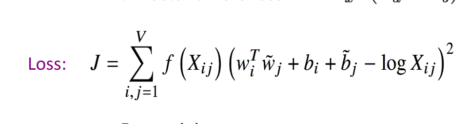

벡터 i,j의 내적과 동시 등장 행렬에서 단어 i,j 값, Xij가 같아지도록 하는 값임.

앞에 붙은 f(Xij)는 가중치항 -> 동시 등장 출현 빈도가 높은 단어 쌍에느 낮은 가중치 부여(Loss 증가) , 빈도가 낮은 단어는 높은 가중치 부여로 더 정교한 임베딩이 가능

이 때의 f() 는

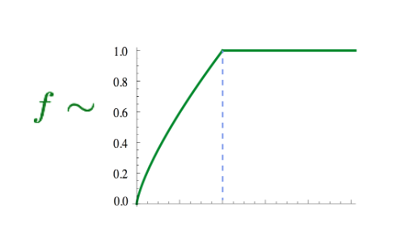

단, 높은 빈도수 -> 지나치게 큰 가중치는 안됨. 따라서 일정 빈도가 넘어서면(fmax) 도달 시 최대값으로 가중치항 고정

1. 빠르고
2. 큰 말뭉치에 대해서도 통계적 임베딩 모델 구축 가능

## How to evaluate word vectors?

NLP 기준 2가지가 있음

Intrinsic

- 특정 subtask에서 혹은 중간 단계에서 평가 진행
- 시스템 이해에 도움을 주고, 평가 계산이 빠름
- but, 해당 평가가 실제 task에 좋은 영향을 줄 지는 모름

Extrinsic

- 실제 task에 대해 평가
- but, 결과가 아래의 subsystem 문제인지, 혹은 subsystem 간의 연결 문제인 지 알 수 없음

### Intrinsic word vector evaluation

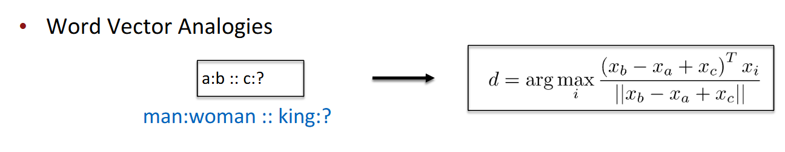

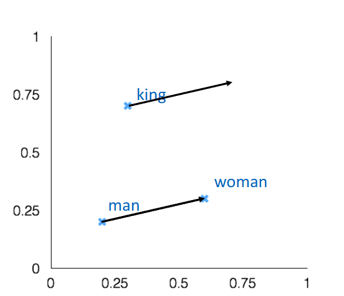

어떤 단어 벡터에 대해 특정 의미론적 질문에 대해 벡터를 더하면 얼마나 잘 대답 할 지 예상하는 평가

but, 벡터 관계를 더해 구할 수 있는 관계에 대해서만 평가가 가능 -> 어떤 관계가 선형으로 결합되는 관계가 아니라면 평가가 불가능

### GloVe Visualization

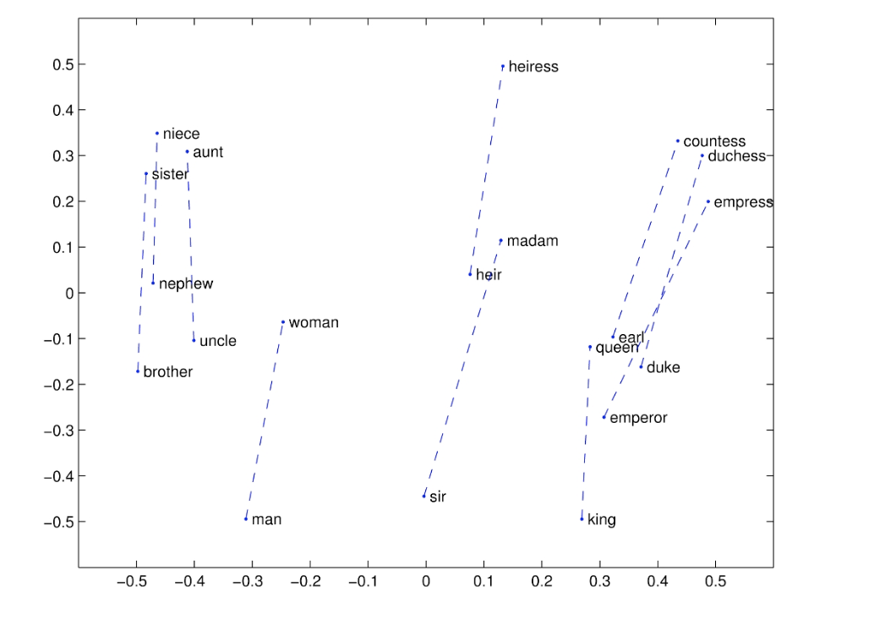

이 또한 유사하게 잘 벡터 공간에서 단어끼리 관계가 선형을 유지함

### Meaning similarity : Another intrinsic word vector evaluation

어떤 단어 쌍에 대한 사람의 판단과 단어 벡터 간 유사도와 거리를 평가

WordSim353 평가 결과 GloVe가 다른 방법(SVD) 비해 좋은 Intrinsic 평가를 받음 (좋은 결과 => 양질의 데이터 확보 유무 때문)

### Extrinsic word vector evaluation

Extrinsic평가의 예로는 NER(named entity recogntition, 개채명인식) task가 있음 -> 임베딩 모델 성능 유추 가능

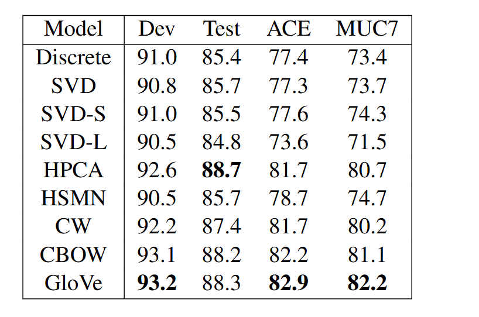

## Word senses and word sense ambigutiy

단어 하나에 한 뜻만 있는 것이 아님. but, 이를 하나의 벡터로 임베딩하는 것은 문제가 있을 수 있음.

해당 문제의 해결을 위해 미리 클러스터링 해서 임베딩하는 방법이 있음.

임베딩 벡터 시각화 :

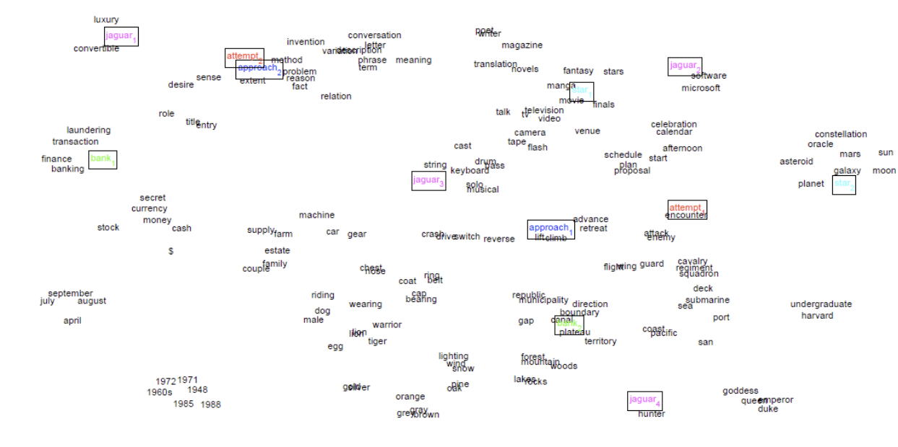

예시로, jaguar의 경우 왼쪽 위에 있는 luxury, convertible이라는 단어와 함께 있는 것으로 보아 자동차 브랜드 jaguar를 의미하고, 중간에 keyboard와 같이 있는 jaguar의 경우는 키보드 브랜드 jaguar를 의미하며, 오른쪽 아래의 jaguar는 hunter와 같이 있는것으로 보아 동물 jaguar를 의미

but, 위 방법은 한 단어가 갖는 의미들을 깔끔히 클러스터링 하기 힘듬.

이를 선형 결합을 통해 해결하고자 함. -> 여러 단어 임베딩 벡터들의 가중치합을 통해 단어 벡터를 구할 것임.

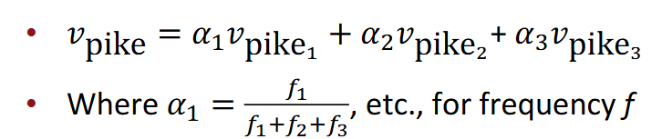(pike 라는 단어를 예시로 사용)

한번에 결합된 단어 벡터가 여러 의미를 갖음. 이를 space coding을 통해 분리 가능.

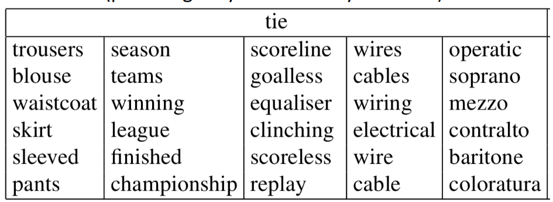

Deep Learning Classification : Named Entity Recognition (NER)

NER? 어떤 텍스트 내 특정 단어에 태그를 달아주는 task.

ex)

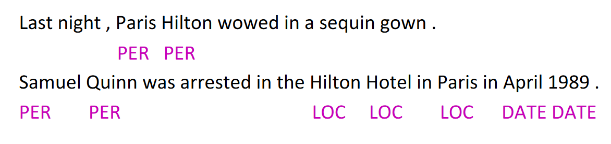

어떤 단어 근처 위치한 던어들로 구성된 context window 내에서 그 단어를 구별해주는 task.

이는 window 내 단어 벡터들을 concatenation한 벡터를 이용해 logistic classifier로 yes/no 태그를 붙여줌.

예시로, Paris 라는 단어 근처 2개의 단어를 context window로 설정 시, 다음과 같은 input vector 생성.

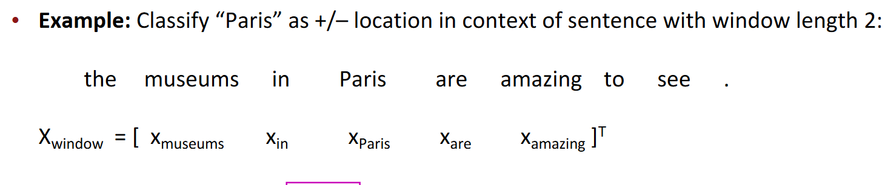

해당 벡터의 차원은 다음 과정에 따라 classify 진행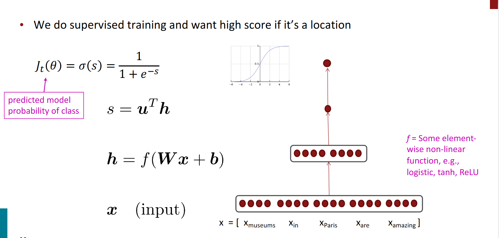

해당 수업에서 사용하는 Neural classification 에 대해

## Neural classification

w 가중치 뿐 아니라 단어의 분산 표현도 학습

재표현된 벡터 측면에서는 선형 분류가 가능하지만, 원래 공간에서는 불가능(예시는 위 사진을 같이 사용)

## Training with “cross entropy loss”

과제 2 : Pytorch 사용 : 교차 엔트로피 Loss 사용 예정

교차 엔트로피 : 실제 확률 p와 확률 분포 q가 있을때, 다음과 같은 엔트로피 확률을 얻음.

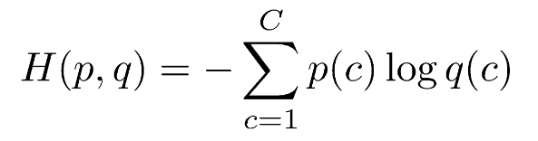

올바른 클래스 : 확률 1 / 다른 합산은 0으로 감 그렇다면 남는 것은,

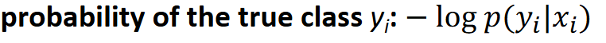

모델 구축 시 교차 엔트로피 손실 함수를 사용해야함!

### A neural network = running several logistic regressions at the same time

신경망의 경우 단일의 로지스틱 회귀 분석이 아닌 여러개의 로지스틱 회귀 분석이 있음

여러개를 하나하나 구하기는 어렵지만, 결국 목적은 여러개의 로지스틱 회귀 분석을 하나의 로지스틱 회귀 분석에 입력하는 것 뿐임

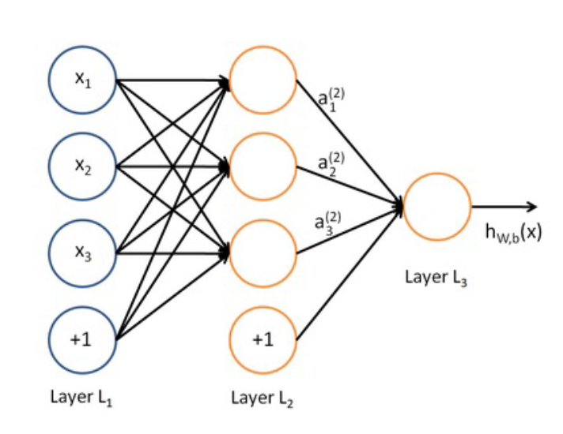
