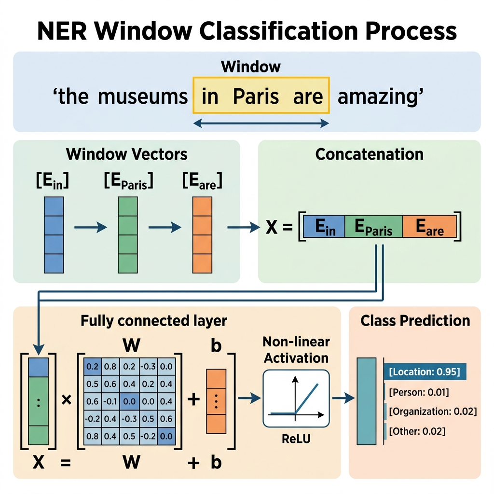
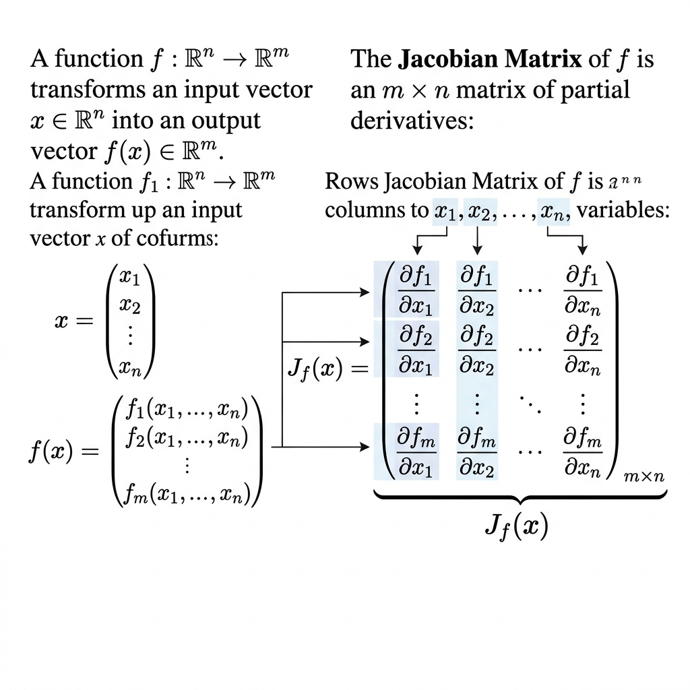
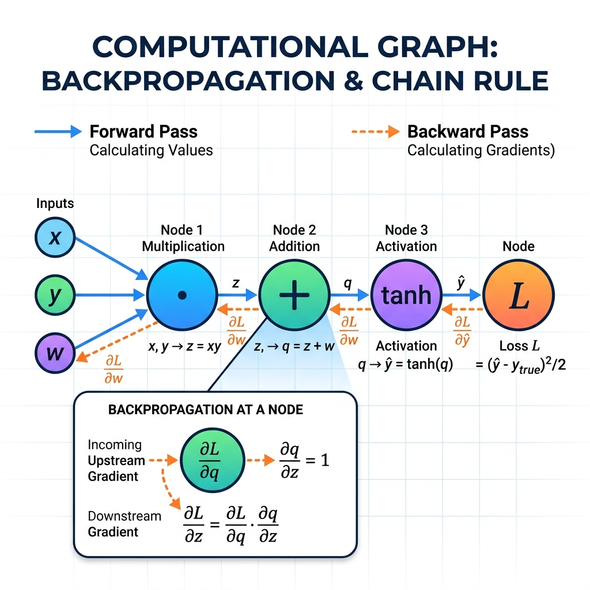

# **[cs224n NLP 강의정리]** Lecture 3. Backpropagation, Neural Network [출처] [Stanford CS224N - Lecture 3. Backprop and Neural Networks](https://byeonggeuk.tistory.com/7)

참조 : https://byeonggeuk.tistory.com/7
강의 자료 : cs224n-2024-lecture03-neuralnets.pdf

본 내용은 Stanford CS224N: NLP with Deep Learning 강의 내용을 기반으로 정리했습니다.

---

## 1. 개체명 인식 (Named Entity Recognition, NER)

NER은 텍스트 내의 각 개체(Entity)의 유형을 인식하는 task입니다. 어떤 단어가 사람, 장소, 조직 등을 의미하는지 찾는 것이 목표입니다.

### Simple NER: Window classification
이웃 단어들의 문맥(Context window)을 이용하여 단어를 분류하는 방식입니다.

*   **예시**: "the museums in Paris are amazing to see."에서 "Paris"를 인식할 때
*   **방법**: 중심 단어 주변의 window(예: 길이 2)를 설정하여 단어 벡터들을 구성합니다.
*   **과정**: 
    1. 각 단어 벡터를 연결(Concatenate)하여 고차원 벡터 생성.
    2. Neural Network layer에 입력 (가중치 matrix W와 곱하고 bias b를 더함).
    3. 활성화 함수(f)를 적용하여 **Non-linearity** 추가.
    4. Softmax 등을 통해 특정 클래스에 속할 확률 계산.

---

## 2. 행렬 미분 (Matrix Calculus)

신경망을 효율적으로 학습시키기 위해 파라미터(W, b)에 대한 기울기(Gradient)를 계산해야 합니다.

### Jacobian Matrix
여러 매개변수를 가진 함수(m개의 output과 n개의 input)에서 각 요소의 편미분 값을 나타낸 m x n 행렬입니다.

*   **Shape Convention**: 복잡한 수식 유도보다는 입력과 출력의 차원(Shape)을 맞춰가는 방식으로 기울기를 계산하는 것이 효율적입니다.

---

## 3. 역전파 (Backpropagation)

역전파는 출력층의 오차(Loss)를 역방향으로 전달하며 각 가중치를 업데이트하는 알고리즘입니다.

### Chain Rule (연쇄 법칙)
복합 함수의 미분은 각 단계의 미분값의 곱으로 표현됩니다. 
- **Upstream Gradient**: 뒤쪽에서 전달된 기울기
- **Local Gradient**: 현재 노드에서의 미분값
- **Downstream Gradient**: 위 두 값을 곱하여 앞쪽으로 전달되는 기울기

### Local Error Signal (delta)
Neural Network를 효율적으로 학습시키기 위해 반복되는 계산을 피하도록 정의된 중간 미분값입니다. 이를 통해 계산 효율성을 극대화합니다.

---

## 4. 신경망의 비선형성 (Non-linearity)

단순히 선형 결합(Wx + b)만 반복하면 결국 하나의 선형 함수가 됩니다. 이를 복잡한 함수를 근사하기 위해 **비선형 활성화 함수**를 사용합니다.

*   **ReLU (Rectified Linear Unit)**: f(z) = max(0, z). 최근 가장 널리 쓰이는 활성화 함수입니다.
*   **Sigmoid / Tanh**: 초기 모델에서 자주 사용되었으나, 최근에는 ReLU 계열이 더 선형에 가까운 특성 덕분에 학습이 잘 됩니다.

---

**[요약]**
Lecture 3은 신경망이 어떻게 복잡한 언어 데이터를 처리하는지, 그리고 수학적으로 어떻게 효율적으로 학습(역전파)되는지에 대한 핵심 원리를 다룹니다. 특히 행렬의 차원을 추적하며 미분을 계산하는 능력이 중요합니다.