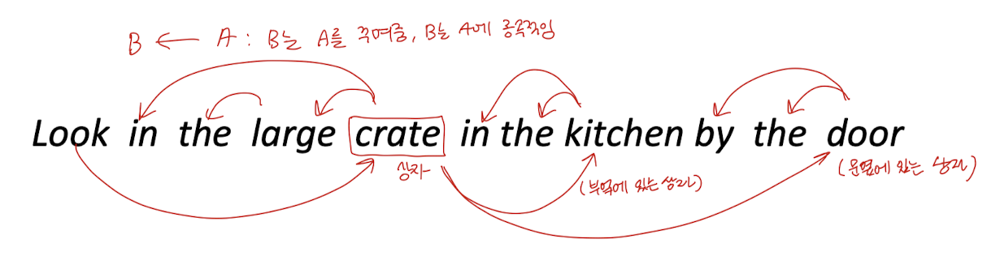
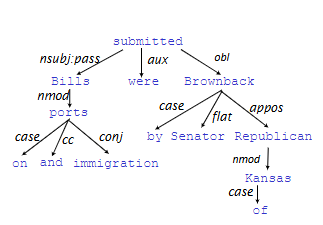
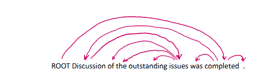
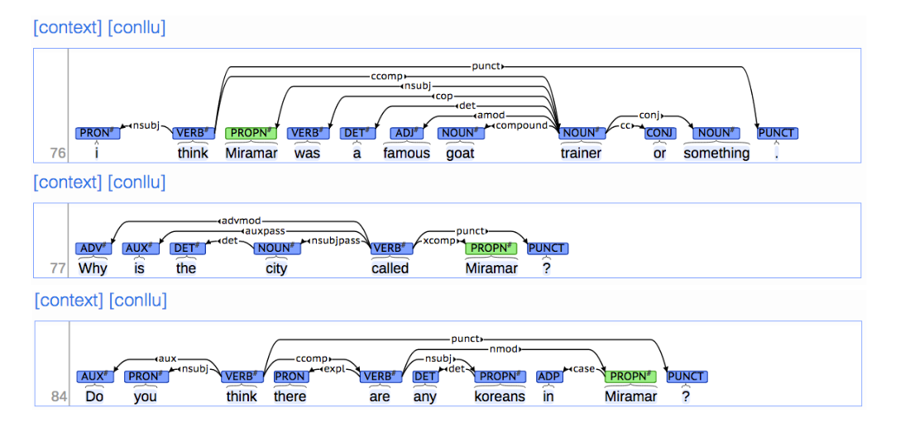
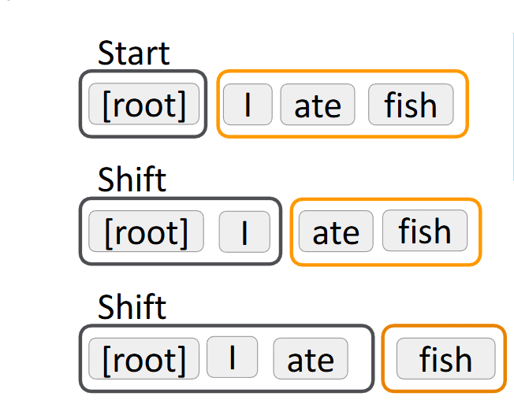
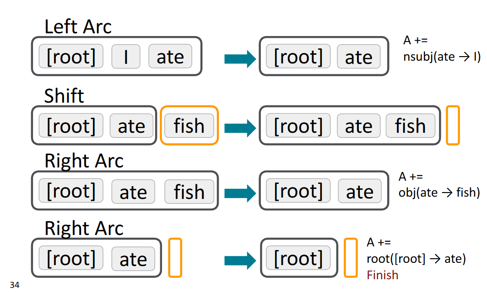
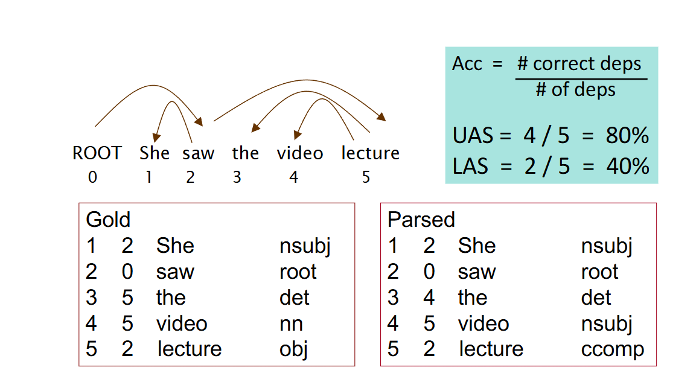

# Lecture 4 - Dependency Parsing

Dependency parsing - 의존적 구문 분석으로 텍스트 내 단어들 간 의존 관계를 분석

syntatic structure : 구문 구조, 문장을 하위 구조로 쪼개기

consistuency structure : 구성 구조, 단어의 종속관계에 상관 없이 텍스트를 세부적으로 쪼갤 수 있는 구조

dependency structure : 의존 구조, 단어들이 종속관계를 가지는 구조

parser : 구문 분석기

nested constituents(중첩된 성분) : constituents는 의미 있는 단위를 말함. 문장이 단순 단어들의 나열이 아닌, 특정 단어끼리 뭉쳐서 하나의 덩어리를 이룸.

nested는 이 덩어리 안에 또 다른 작은 덩어리들이 상자 속 상자처럼 들어간 것을 말함 큰 단위 안에 작은 단위가 포함되는 이런 계층 구조를 말함

### Consistuency structure : context-free grammers(CFG)

Consistuency structure는 텍스트가 nested consistuents로 구성되어 있음. 단어들이 결합되어 절이 만들어지고, 절들이 결합해 더 큰 절이 만들어짐.

ex) the cat cuddly by door이라는 단어들로 'the cuddly cay' , 'by door'라는 절을 만들 수 있고, 'the cuddly cay by the door' 이라는 더 큰 절을 만들 수 있음. 이때 'the'는 determiner, 'cat'과 'door'는 noun, 'cuddly'는 adjective, 'by'는 preposition(전치사)이다. 'the cuddly cat'는 NP(Noun Phrase)이고 'by the door'는 PP(Preposition Phrase)이다. 'the cuddly cat by the door'는 또다른 NP이다.

### Dependency structure

Consistuency와 dependency 같은 텍스트를 다른 방식으로 구조화하는 방식 Consistuency는 단어들끼리 관계를 고려치 않고 품사나 절로 쪼개는 반면

Dependency는 단어간 의존 관계를 중심으로 파악.

두 방식 중 dependency struture로 텍스트를 해석하는 것을 Dominant하다고 칭함.

화살표(arcs)로 의존 관계를 표시.

large는 crate의 modifier(수정자)로 crate를 꾸며줌 -> large는 crate에 의존적임

ex)'Scientists count whales from space'

prepositional phrase의 모호성을 보여줌. from space라는 prepostitonal phrase는 '우주에서 온 고래'라는 의미와 '우주에서 위성으로 찍은 고래'라는 중의적 의미를 내포함.

따라서 parsing decision은 다양한 consistuents를 어떻게 attach하는 지를 결정함

Dependency structure는 문법적 구조의 의존성이라는 단어들의 비대칭적 문법적 관계에 따라 구성된다고 가정.

'submitted'는 head, 'Bills', 'were' , 'Brownback'은 dependent가 되고, 이가 head와 각각 주어, 조동사, 목적어 관계를 가짐. Head는 governer, superior이고 dependent는 head를 modifier, inferior이고 head를 꾸며주는 기능을 함.

하지만 하나의 텍스트에서 의존 관계를 표시할 때 사라믈마다 다르게 표시함. 따라서 가상의 root를 추가해 모든 단어가 적어도 한 개의 단어에 의존할 수 있도록, 어떤 단어의 dependent가 될 수 있도록 함. 아래 그림을 예시로 설명함

최근 연구로는 head -> dependent 방향으로 화살표를 그림

### Dependency Grammer and Dependency Structure

"treebank"는 구문 분석이나 언어학적 정보를 포함하는 주석이 달린 텍스트들의 모음. 이 주석은 주로 문장 구조를 나타내는 데 사용되는 구문 트리의 형태로 이루어짐.

treebank의 장점

재사용 가능

커버 가능 범위가 넓음

문장 구조 분석을 통해 통계 정보를 얻고, 활용이 용이함

NLP 평가에 사용이 가능

#### Transition-based dependency parsing

Dependency parsing에는 4가지 방식이 있음

- Dynamic programming : O(n^3) 차원으로 비효율적
- Graph algorithms : 그래프로 표현하여 neural graph-based parser에서 성공적
- Constraint Satisfaction
- Transition-based pasing or deterministic dependency parsing

Greedy transition-based parsing

parsing 과정은 buffer, stack, Set of Arcs라는 3가지 구조를 가짐.

stack은 현재 처리할 단어가 있는 곳, buffer은 아직 처리되지 않은 단어, Set of Arcs는 parsing의 결과물이 담김.

parsing에는 3가지 decsion 있음

1. shift : Buffer의 토큰이 stack으로 이동
2. Right-Arc : stack에 있는 두 단어 중 오른쪽 단어를 지움 스택 위 올라운 두 단어를 비교해, 왼쪽이 대장이면 실행
3. Lect-Arc : stack에 있는 두 단어 중 왼쪽 단어를 지움 스택 위 올라온 두 단어를 비교해, 오른쪽이 대장이면 실행

화살표를 받아 종속어가 된 단어는 그 즉시 pop 점진적으로 축소함

ex) I ate fish

검정 태두리 : stack

주황 태두리 : buffer

처음 들어온 상태에서 stack은 root밖에 없으니, decision은 shift임. 후에 I가 들어와도 분석할 구문이 없기에 ate도 shift함

후에, Left-Arc를 통해 I 와 ate 관계를 Arcs 집합(A)에 추가하고 dependent I를 제거.

그 후 shift를 해 fish 를 stack으로 가져옴

이후 Right-Arc를 통해 ate에서 fish로의 관계를 Arcs 집합(A)에 추가해 dependent fish를 제거.

Right-Arc를 한번 더해서 root와 ate 관계를 Arcs 집합(A)에 추가해 ate를 제거 후 종료 조건을 만족하므로 종료

### Evaluation of Dependency Parsing

각 단어의 왼쪽의 숫자는 단어가의존하고 있는 단어의 index이고, UAS(Unlabelled Accuracy Score)은 index를 기준으로 한 accuracay이고 LAS(Labelled Accuracy Score)은 index와 품사를 잘 예측했는 지 에 대한 accuracy임

UAS : 올바른 중심어를 맞춘 단어의 비율을 측정하는 비부착 점수 (어떤것이 중심어 인지만 맞추면 고득점)

LAS : 중심어와 문법적 역할 라벨까지 정확히 예측
