Lecture 5: Language Models and Recurrent Neural Networks

참조 : https://manywisdom-career.tistory.com/15

https://hw-hk.tistory.com/191

문장에서 나온 단어들 이후에 나올 단어 예측

RNN : 다음 올 단어를 예측하는 과제를 효과적으로 수행하기 위해 도입한 NN의 일종

### Language model

정의

단어의 문장에 대해 얼마나 자연스러운 문장인 지 '확률'을 이용해 예측하는 모델

Language modeling = 주어진 단어의 시퀸스에 대해 다음 나타날 단어가 어떤 것인 지 예측하는 작업

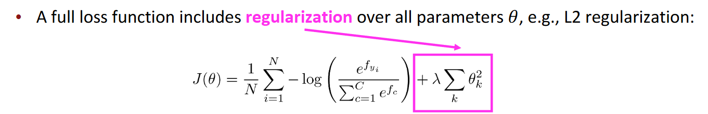

매개변수의 가중치가 작은 모델을 찾는 것이 좋다는 것을 이야기함

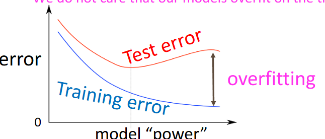

이는 과적합 문제로, 매개변수의 값을 작게 설정하면 과적합을 줄일 수 있음

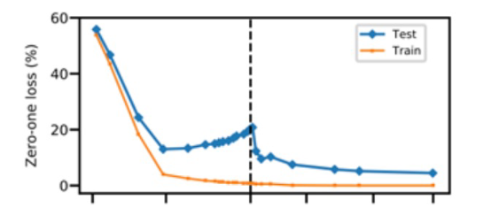

다양한 데이터에 대해 일반화 성능이 뛰어난 모델을 찾고 있음 , 해당 이론에서는 overfit에 대한 것을 신경쓰지 않음

위 사진처럼 과적합이 일어나는 것 처럼 보일 수 있지만 거대한 네트워크에서 계속 학습을 진행 시 검증 손실이 감소하게 된다.

풍부한 네트워크로 손실은 0으로 하게 됨.

### Dropout

학습을 진행할때마다 중간계층에서 일부 입력값을 버리는 것임 -> 무작위 마스크로 학습

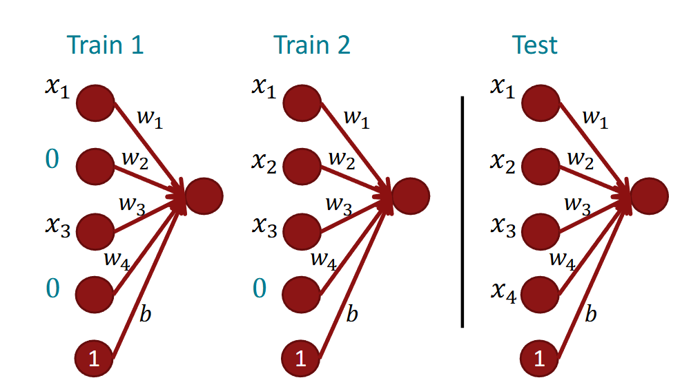

Preventing Feature Co-adaptation은 좋은 정규화 방법이다. Feature co-adaptation은 신경망 학습 과정에서 여러 특징들이 서로 너무 의존하게 되는 현상이다. 이는 특정 데이터 셋에 대해 너무 최적화되어 일반화 능력이 떨어지는 원인이 될 수 있다. 즉, Feature-co-adaptation을 방지하는 것은 모델을 더 강건하게 만들고 각 특징들이 독립적으로 유용함을 보장하기 위해 중요하다. 이를 방지하기 위해 Dropout을 사용

Training time: 일부 뉴런에 대한 입력값을 0으로 변경하여 비활성화를 한다.

Test time: 모든 모델 가중치를 이용하여 평가한다.

### Parameter Initialization

일반적으로 파라미터 행렬의 초기화는 매우 작은 랜덤한 값으로 이루어짐. 이때 0행렬은 허용하지 않음. 이는 여러 문제를 일으킬 수 있기때문.

1. 해당 특징 행렬을 통과하는 뉴런의 값이 같아짐
2. 서로 다른 특징의 학습이 이뤄질 수 없음

따라서 대부분 특징 행렬은 Uniform(-r,r)의 분포를 따라 초기화가 이루어짐. 이때 분산은 Xavier initalization을 통해 궇살 수 있음

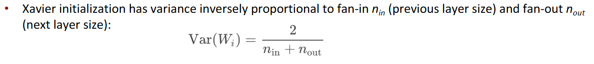

다만, 추후 배율 layer normalization을 제대로 수행하면, 특징 행렬 초기화는 큰 영향을 주지 않음

### Opimizers

학습 진행하는 optimizer로 SGD는 괜찮은 성능을 보임. 하지만, SGD를 통해 좋은 성능을 내기 위해 학습률이나 여러 튜닝들이 필요함(데이터의 shuffle은 필수. 태스크와 관계 없는 데이터 입력의 순서가 모델의 학습에 영향을 줄 수 있음.)

### Learning Rates

학습률로 그냥 샹수를 사용할 수 있음. 이때 학습률이 너무 크면 수렴할 수 없고, 너무 작으면 학습 진행 시 너무 오랜 시간이 걸리기에 적절한 학습률 선택이 중요함.

하지만 학습률을 크게 시작하여 점점 줄이는 형태가 좋을 때가 많음

손으로 학습률을 계산할 때는 하나의 epoch마다 학습률을 절반씩 줄이는 방법 혹은 cyclic learning rates와 같은 방법을 사용하기도함.

### Language Modeling(언어 모델)

언어 모델은 어떤 안어가 왔을 때, 다음 단어로 어떤 것이 나올 지 예측하는 모델을 말함

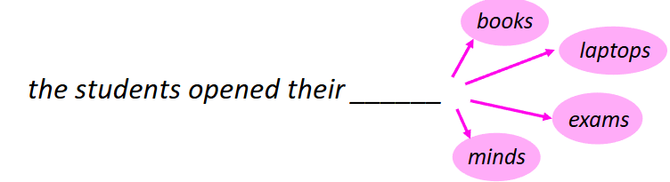

이를 공식으로 표현하면,

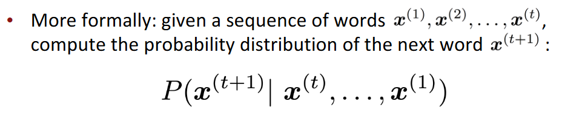

어떤 단어들이 순서대로 x1,x2...,xt일 때, 조건부 확률 P(xt+1|xt,...,x1)을 구하는 것. 즉 이전 단어들이 왔을 때, 다음 단어 xt+1이 나올 확률을 구해 다음 단어를 예측하는 것임.

이때 조건부 확률의 and확률은 다음과 같은 방법으로 구할 수 있음.

조건부 확률의 and확률은 다음과 같은 방법으로 구함

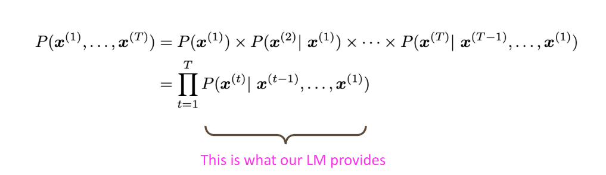

### n-gram Language Models

신경망이 나오기 전 언어 모델은 n-gram 언어 모델이었음

n-gram ? : 연속하는 n개 단어들의 묶음

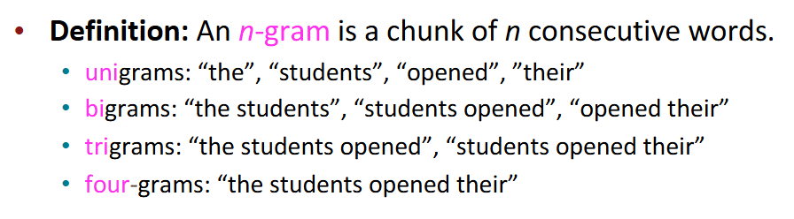

이에 대해 각기 다른 n-gram의 통계를 구해 다음 단어를 예측하는 대에 사용할 수 있을까 하는 아이디어를 통해 언어 모델을 구축함

이에 대한 예시로 Markov assumption이 있음

#### Markov assumption

Markov 가정은 x(t+1)라는 단어를 예측하는 데에는 선행하는 n-1개의 단어만이 영향을 준다는 것을 가정함.

이를 통해 다음과 같은 확률값을 구할 수 있음.

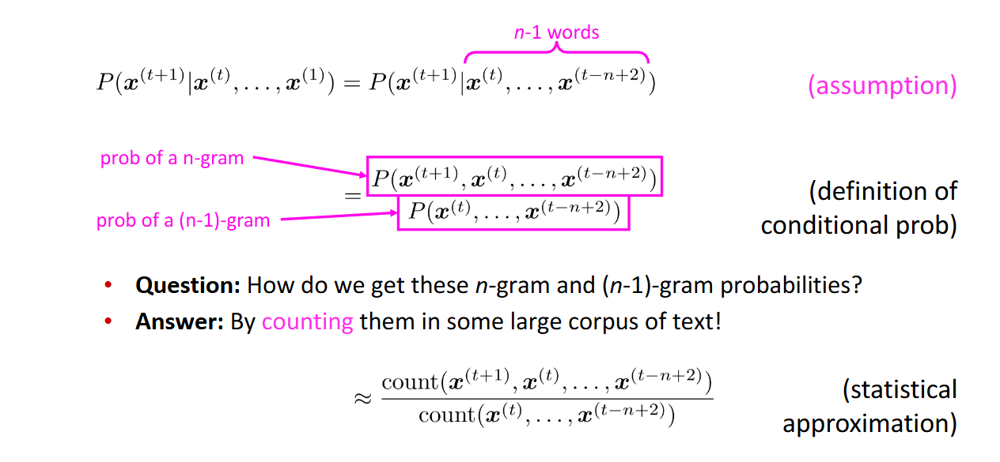

### n-gram Language Models : Example

4-gram 언어 모델 학습의 예시

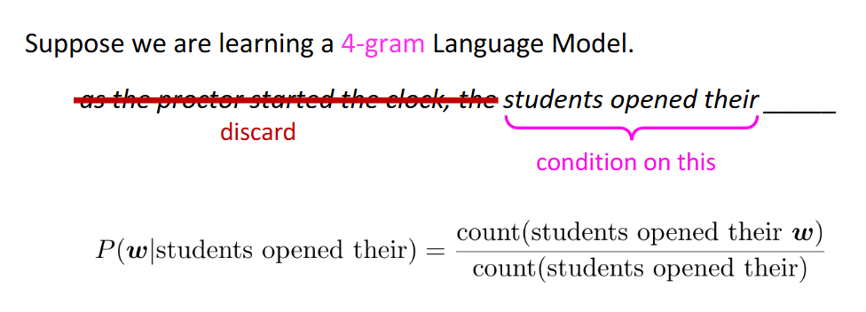

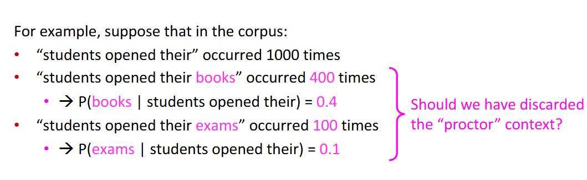

students opened their이라는 연속된 단어들 다음의 단어를 예측하는데 students opened their을 포함하는 4-gram 개수를 통해 확률 사용

students opened their이 1000번 나왔을 때, 그 다음 book이 400번, exams가 100번 등장했다면, books는 0.4, exams는 0.1로 확률 계산 이러한 확률 계산으로 다음 단어를 예측

### Sparsity Problems with n-gram Language Models

다만 이런 n-gram 언어 모델의 단점이 있음. -> sparsity problem임. 이는 발생하는 단어 조합의 개수가 절대적으로 부족한 경우 발생. 예를 들어 students opened their w 라는 말 자체가 한번도 발생하지 않았다면, w가 다음 단어로 나올 확률 자체가 0으로 되버림.

즉, 학습하는 데이터가 나오지 않았던 문장의 경우 예측이 불가능해짐.

이를 해결하는 방법으로 smooting이라는 방법을 사용.

이는 매우 작은 수의 발생 횟수에 더해줌으로써, 발생 횟수가 0인 상황 자체를 만들지 않음.

하지만, 이럼에도 애초에 student opened thier이라는 말 자체가 한번도 발생하지 않았을 시 확률의 분모가 0이 되기 때문에 확률 자체의 계산이 불가능해짐.

또한, 이는 n-gram의 n을 줄임으로써, 4-gram이었다면 tri-gram으로 줄임으로써 간접적으로 해결이 가능했음.

즉, n이 커질수록 sparsity problem의 발생 확률이 증가함. 따라서 일반적으로 n은 5를 넘지 않음

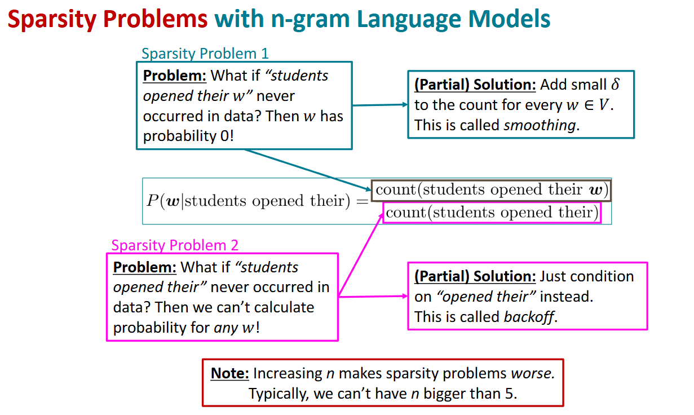

### Storage Problems with n-gram Language Models

저장 용량의 문제도 존재. 예를 들어 n-gram에서 n의 수가 증가하면 할수록 저장해야하는 부분 단어의 개수가 증가하기에 모델 사이즈 자체가 커져버림. 따라서 일반적으로 이런 언어 모델들은 클라우드 아래에서 작동하는 경우가 많음.

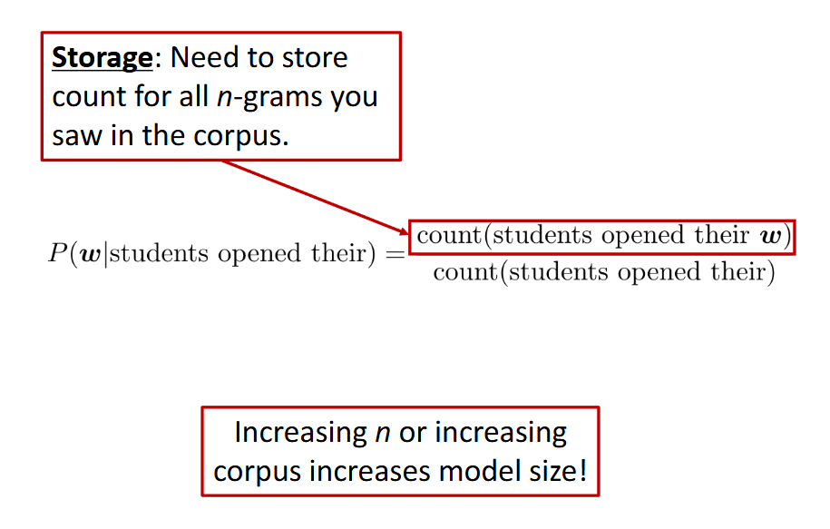\

### Generating text with n-gram Language Model

상위 5개 단어들 중 랜덤하게 다음 단어를 생성하는 방식으로 텍스트르 생성

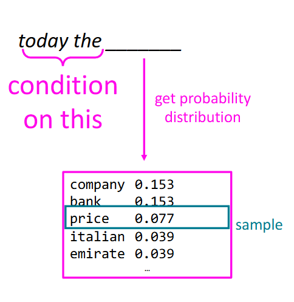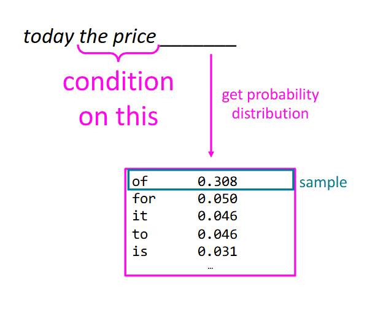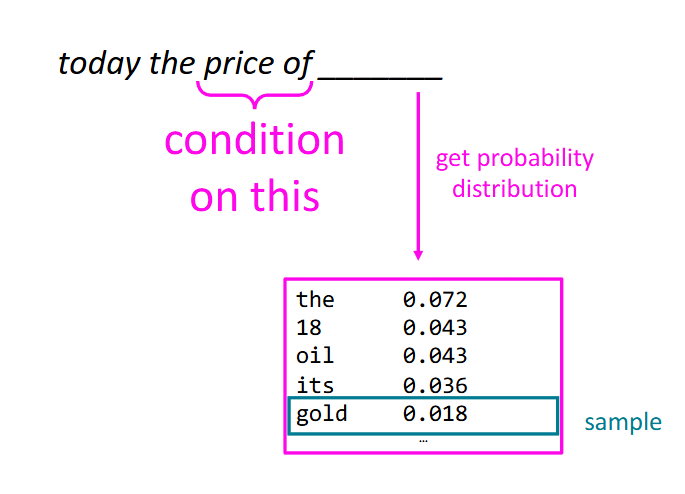

### How to build a neural Language Model?

이는 두 번째 강의에서 보았던 NER 방식을 이용하면 신경망을 통해 모델 구축이 가능해짐.

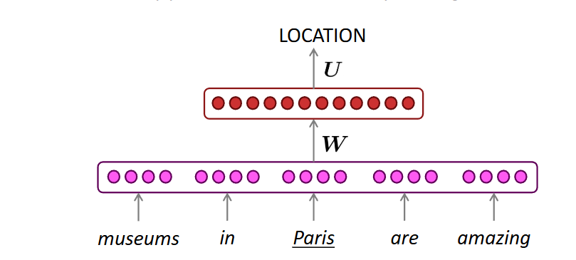

### A fixed-window neural Language Model

NER과 마찬가지로, 고정된 window 안에 있는 단어들을 통해 다음 단어를 예측하는 것으로, 아래 그림과 같이 해결이 가능

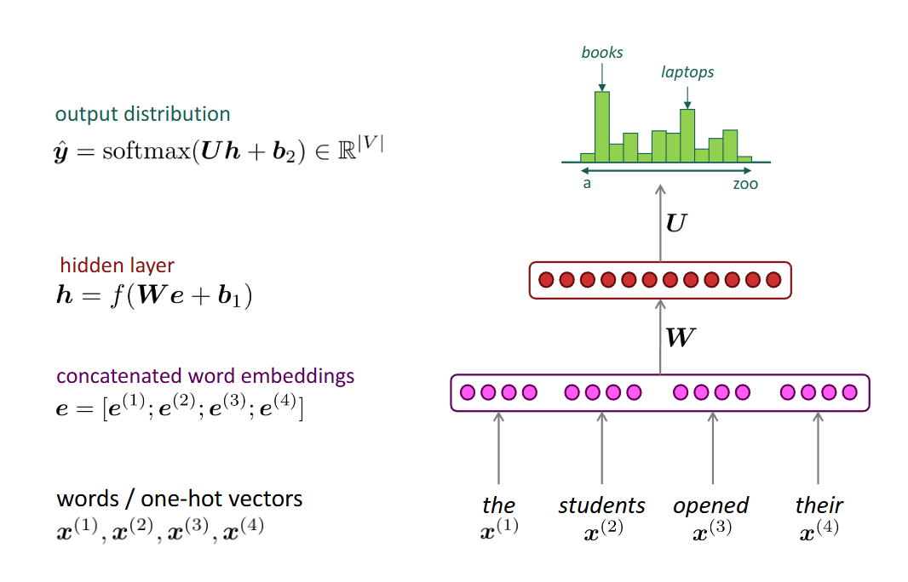

해당 방식은 기존 n-gram 언어 모델에 비해 Sparsity Problem 발생 확률을 줄여주고, n-gram의 정보들을 모두 저장할 필요가 없어짐.

하지만 여전히 문제가 있음

1. 고정된 window의 크기가 매우 작음. 언어적 관점에서 다음 단어를 예측하는 데에는 맥락이 중요한데, window 크기가 4~5단어 정도의 크기라면, 맥락은 파악하기 힘들며 좋은 질의 단어 예측에는 한계가 생김
2. 여러개의 단어들이 내무 가중치행렬 W에 의해 동시에 계산됨. 즉, 어순 반영이 어려움. 영어의 경우 'the' 다음 명사가 나오는 등 어순에 따라 나올 수 있는 단어들이 있는데 이의 반영이 어려움

## Recurrent Neural Networks

이를 해결하는 것이 RNN임. 고정된 window를 사용하지 않기에 문장이 길어도 모두 사용이 가능하고, 차례로 가중치행렬을 곱해줌으로써, 어순을 반영할 수 있음.

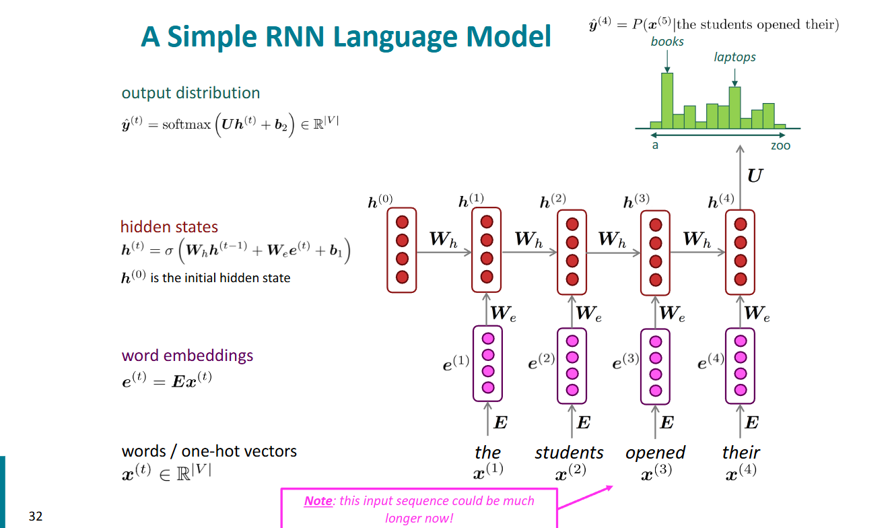

하지만 이것도 문제가 있음

1. 기존 각 단어들을 한번에 가중치 행렬에 곱해줌으로써 계산이 한번에 가능했지만, RNN의 경우 한 단어씩 계산함에 따라 계산 시간이 늘어남
2. window의 크기가 매우 길어질 수 있지만, 정보가 뒤로 갈수록 손실되는 문제가 발생해 사실상 window의 크기의 한계가 존재함.

### Traning an RNN Language Model

입력 corpus에 대해 각각 timestamp t 에 대해 RNN이 생성해내는 t에서의 출력을 y_hat_t라고 하고, 정답 출력을 y_t라고 하면, 다음과 같은 손실 함수를 통해 학습이 이뤄짐.

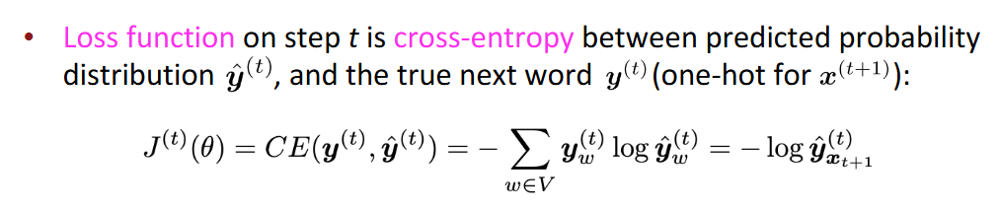

cross-entropy 계산을 통해 정답 단어에 대한 분포와 출력해낸 다어의 분포가 같도록 학습 시킴. 이 때, 전체 손실을 각각의 timestamp에 대한 손실의 평균을 사용

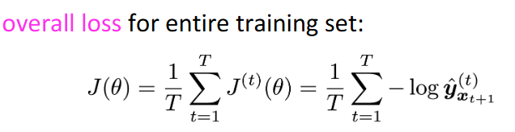

학습 과정은 다음고 같음

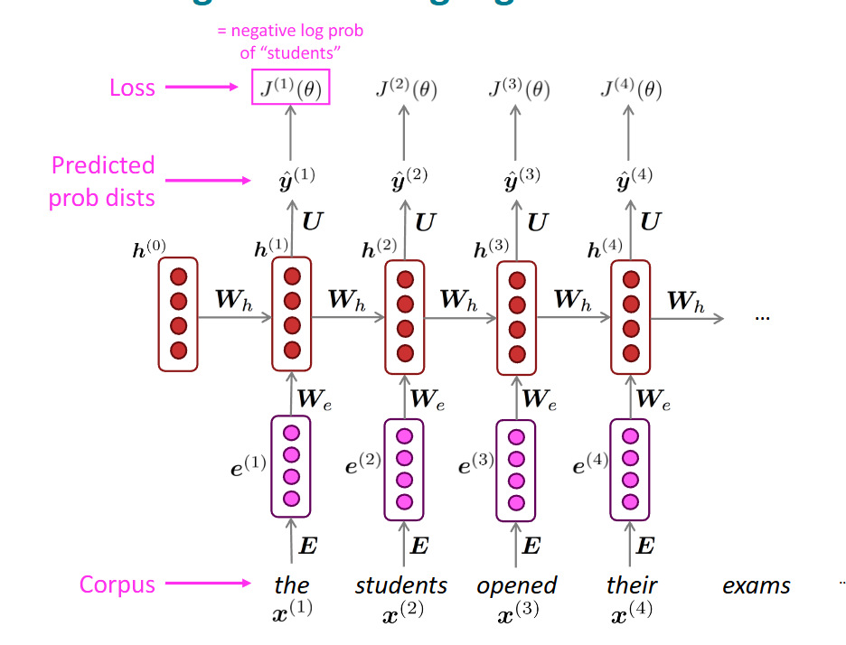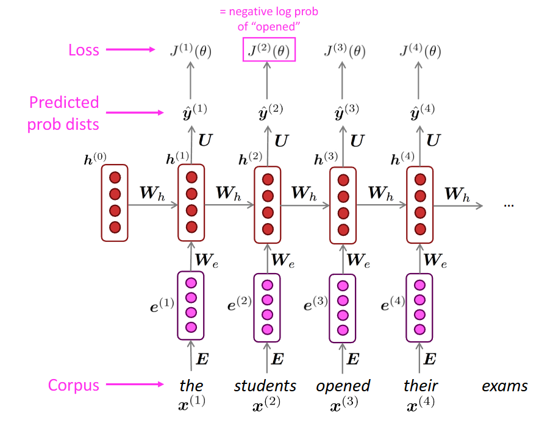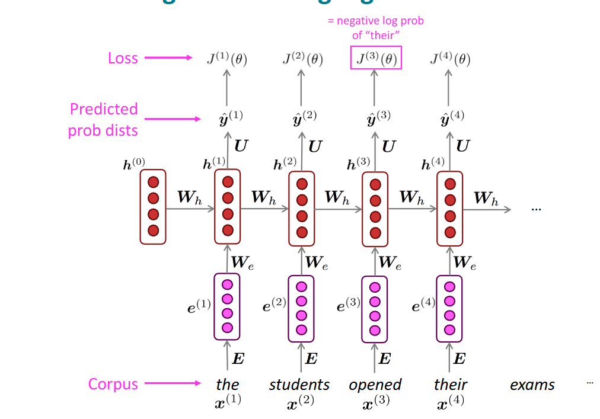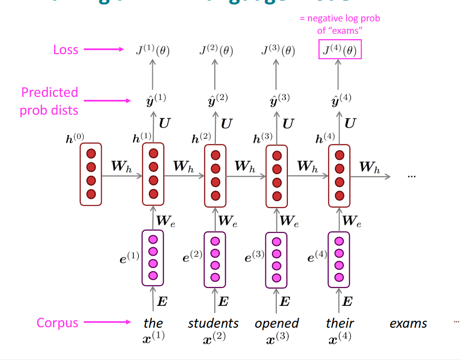

이러한 학습 방법을 Teacher forcing이라고함. 이는 이전 timestep에서 생성된 출력을 다음 timestep에 대한 입력으로 넣는 것이 아닌 실제 corpus의 다음 문장의 입력으로 넣어주는 것을 말함.

즉, 학습을 실제 corpus를 따라 진행하도록 강요하는 것임. 이를 토앻 RNN의 학습단계에서 RNN의 오류 누적을 없앨 수 있음.(if, Language Model처럼 이전 단계에서의 생성을 다음 단계의 입력으로 넣는다면, 생성 단계에서 들어간 RNN의 오류를 그대로 입력으로 넣어 오류가 누적될 수 있음.)

이때 SGD를 사용하기도함. 일정한 크기의 배치사이즈를 갖는 미니 배치 문장들에 대해 한번에 기울기 계산을 진행, 가중치 행렬을 수정함. 이를 통해 RNN 학습하는 단계에서 발생하는 시간 지연을 어느정도 상쇄가 가능함.

### Backpropagation for RNNs

그렇다면 RNN 가중치행려에 대한 기울기를 구하는 방법은?

손실 함수 J(theta) 에 대한 Wh의 기울기는 다음과 같이 구함.

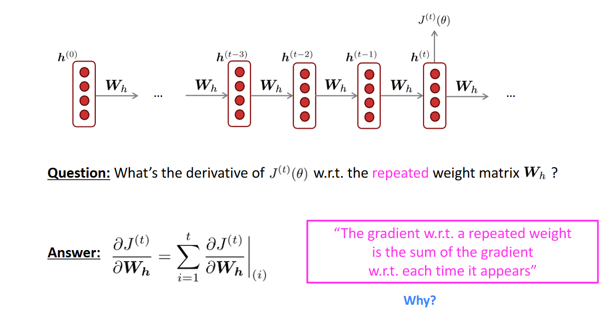

여기서 중요한 점은 ∑임.

즉, 각 출력에 대한 Wh의 기울기를 모두 더하면, 최종적인 손실 함수 J에 대한 Wh의 기울기가 됨. 다변수 함수에 대한 미분을 수행하면 각 변수에 대한 기울기의 합을 나타낼 수 있음.

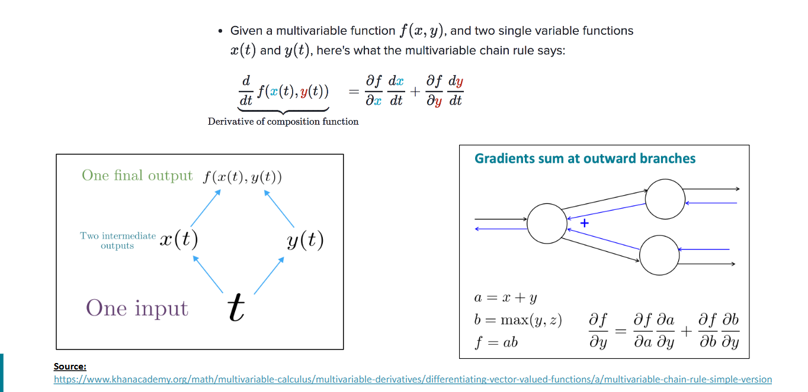

이러한 맥락에서 다변수 함수에 대한 연쇄법칙을 적용하면 다음과 같이 유도

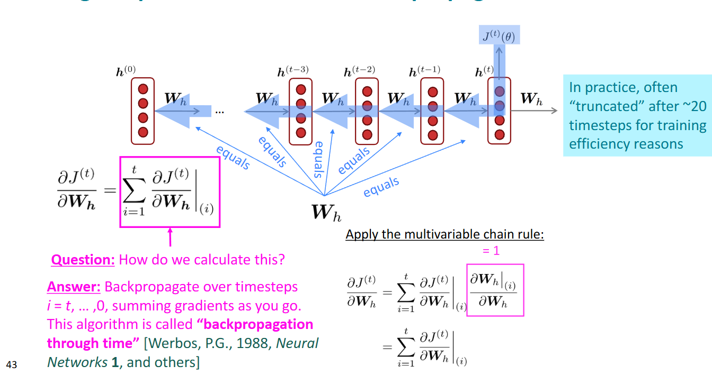

실용적 이유로, ~20번의 timestep까지만 기울기 계산에 활용.(timestep t일때의 dJ(theta)/dWh와 tiemstep t-1일때의 dJ(theta)/dWh는 다름. upstream gradient가 다르기 때문. 따라서 timestep에 따른 dJ()/dWh를 구분해야하며, 이를 dWh(i)라고 함. 위 내용은 각 timestep에 따른 Wh의 기울기들의 합(sigma)를 통해 한번에 계산이 가능함을 보임. 이는 다변수 함수의 미분과 관련된 내용으로, RNN의 과정은 하나의 입력 Wh에 대해 여러개으 함수를 거쳐(각 timestep에서 wh를 사용하는 함수들) J()는 하나의 출력을 낸 것. 그렇다면 각각의 함수에 대해 Wh의 기울기는 각 함수에서 Wh의 기울기들의 합으로 계산을 함)

### Generating with an RNN Language Model (“Generating roll outs”)

n-gram 언어 모델과 유사하게 RNN Language Model 또한 반복적 sampling을 통해 단어를 생성할 수 있음.

샘플링 된 단어를 다시 다음 timestep에서의 입력으로 넣어주기.(Teacher forcing과 다름을 주의) 가장 처음으로 시작하는 `<bos>(beggining of sentence)라는 특수 토큰이고, , <eos>(end of sentence) 특수 토큰 생성 시 문장을 종료하는 방식`

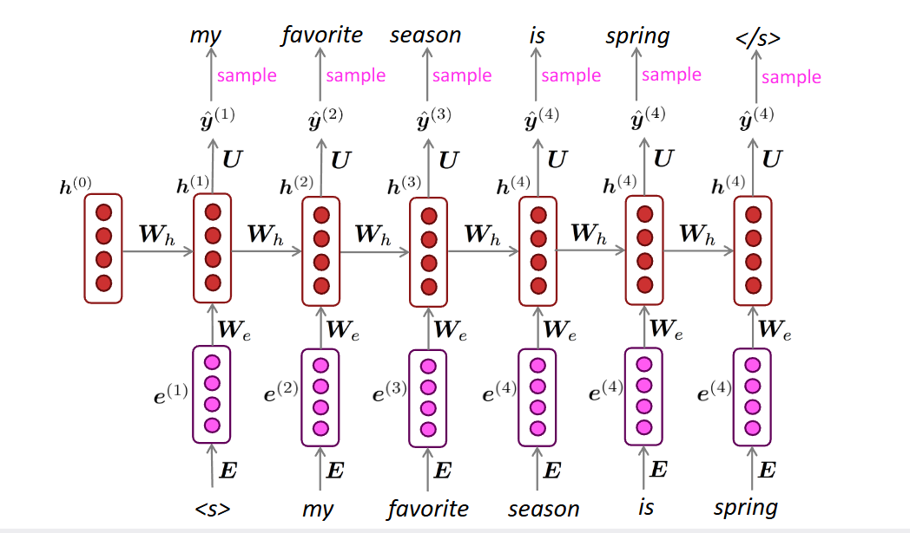

### Generating text with an RNN Language Model

다음은 순서대로 Obama speeches 데이터, Harry Potter데이터, 음식 레시피 데이터를 학습 시 RNN 문장 생성 결과임.

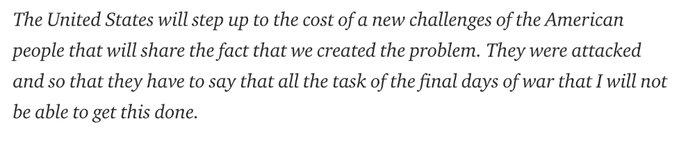

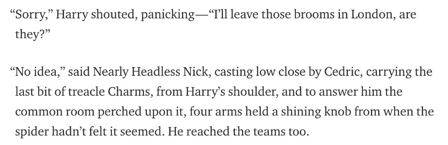

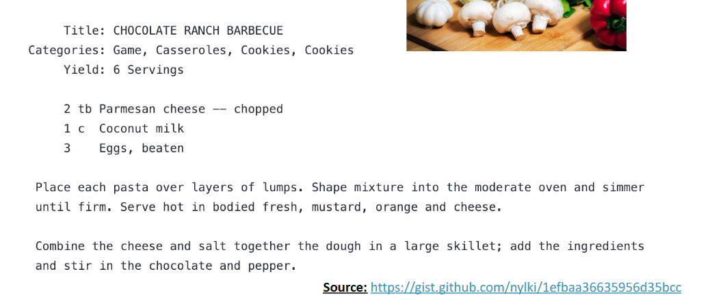

n-gram Language Model과 유사하게 일관성이 없는 모습이지만, 말투, 어투, 기본적인 레시피의 정보들은 학습을 완료한 모습.

### Evaluating Language Model

Perplexity : 모델 성능 평가(모호성 점수)

어떤 안어가 생성될 확률이 강하면, 언어 모델이 어떤 단어를 생성하는 데에 강한 확신을 갖고 있다면 모호성이 낮고, 이는 좋은 언어 모델임을 뜻함

점수 계산은 다음과 같음

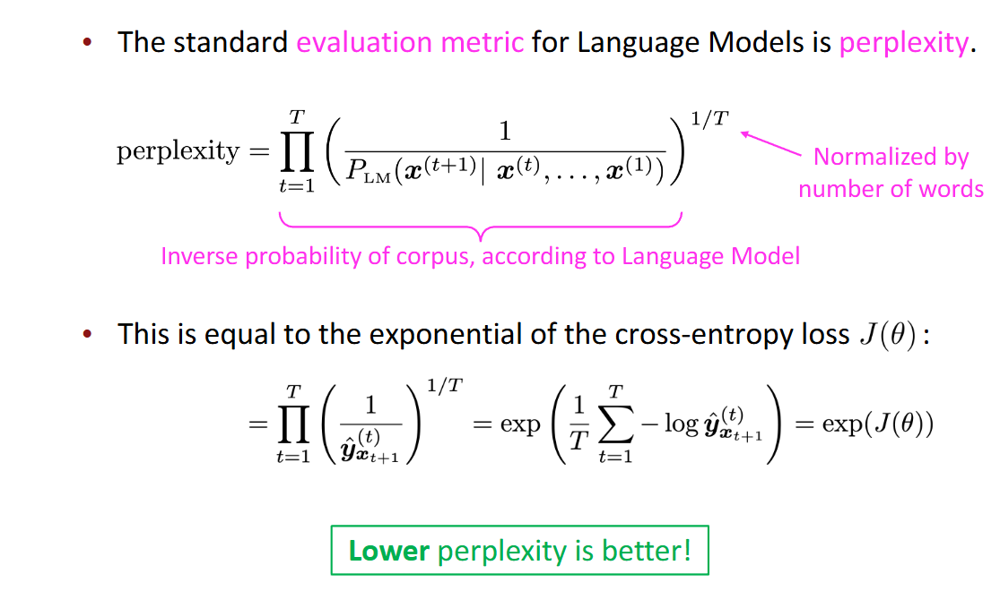

이를 통해 다음 단어가 생성될 확률의 기하 평균으로 해석이 가능함. cross-entropy를 통한 손실 함수 J()의 지수함수꼴과 같음. 즉, 손실은 낮으면 좋기 때문에

perplexity 점수도 낮으면 좋다고 해석이 가능

RNN의 발전에 따라 Perplexity 점수도 계속해서 감소 중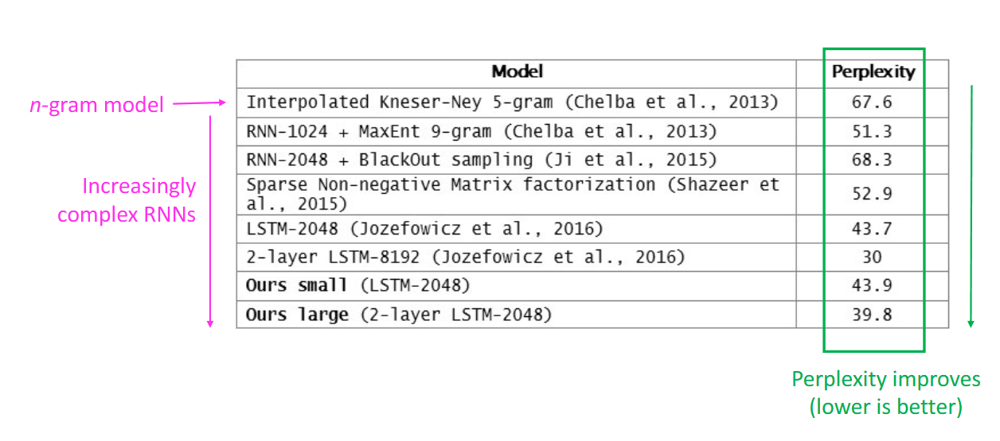

Problems with RNNs : Vanashing and Exploding Gradients

RNN의 대표적 문제로 기울기 소실 문제(Vanishing Gradents)가 있음

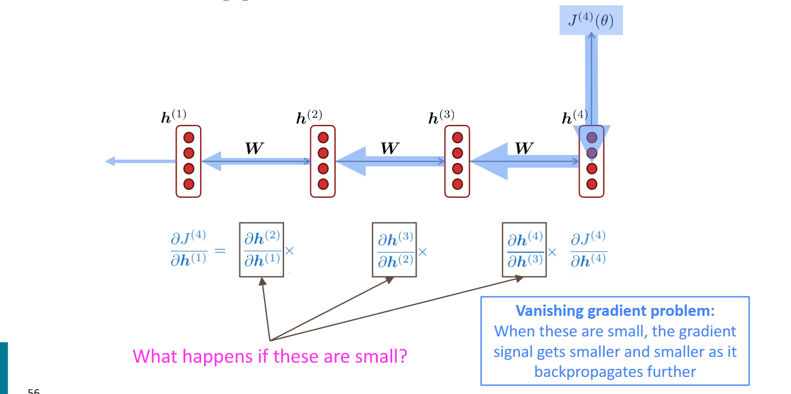

기울기 소실은 연쇄법칙에 따른 역전파에 의해 발생. 손실값 J(4)를 통해 h(1)을 업데이트 하려면, 위 식을 통해 계산해야하는데, 이를 upstream gradient의 곱으로 이뤄져있을때, 해당 값들이 작으면?

-> J(4)에 대한 h(1)의 기울기 업데이트 값이 작아짐. 이는 h(1) 뿐만 아니라, 임의의 upstream gradient의 값이 작아지면, 그 아래의 gradient는 더 작아져 마지막에 가면 가중치 업데이트가 거의 일어나지 않음

### Vanishing gradeint proof sketch(linear case)

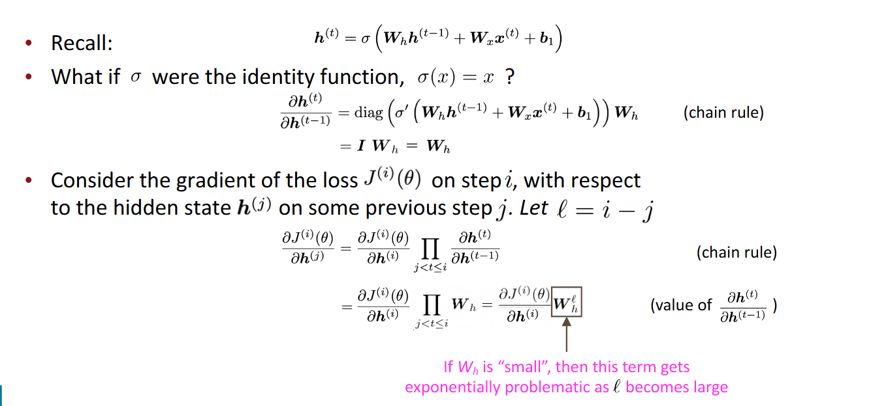
